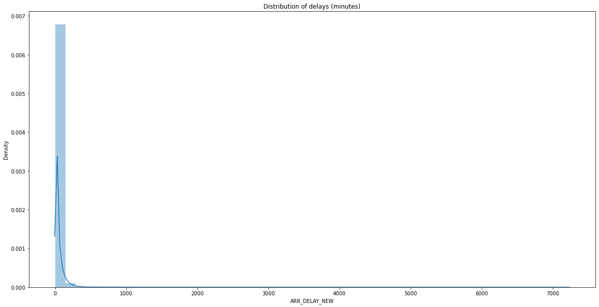
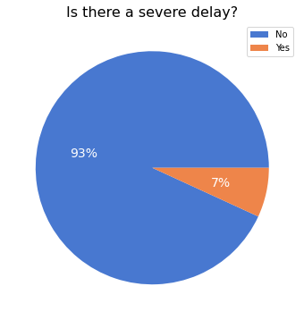
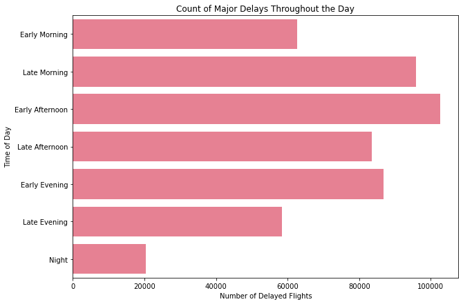
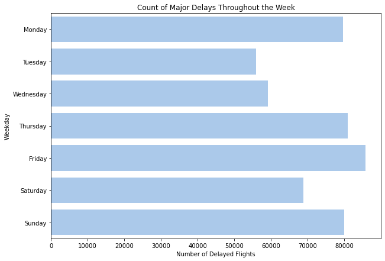
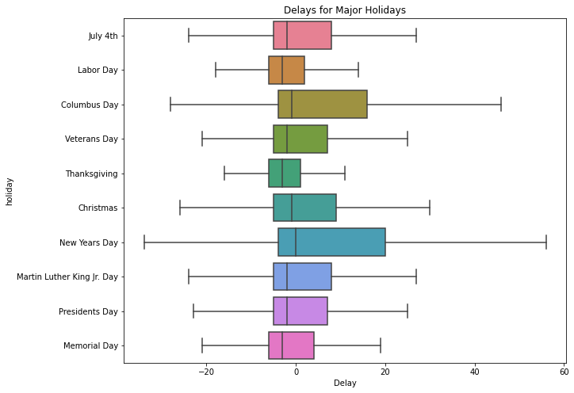
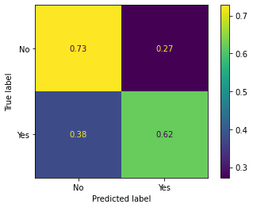
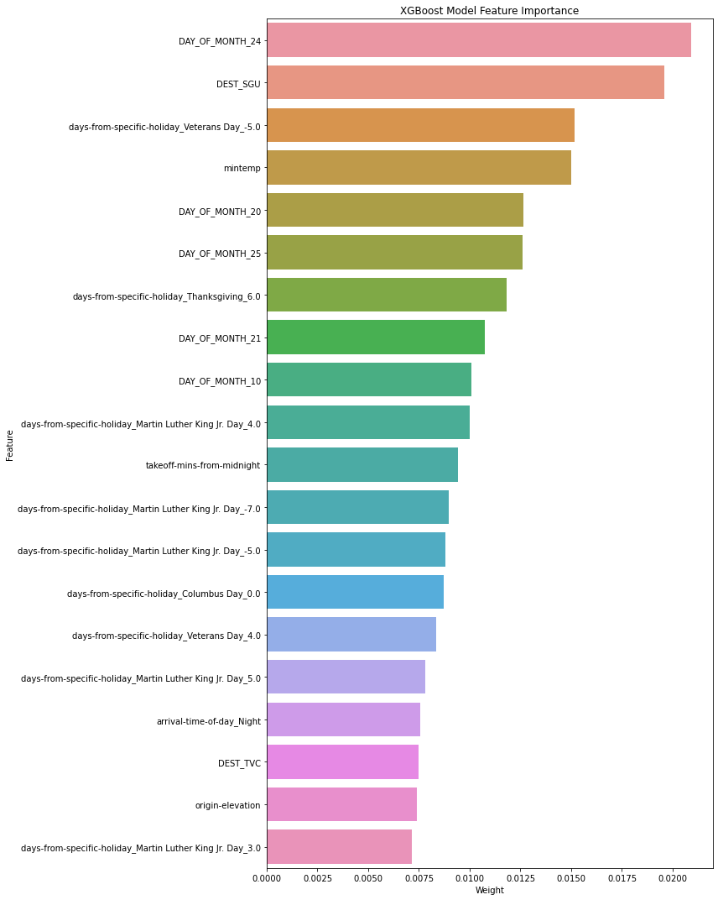

# Predicting Major Flight Delays
Flatiron School Capstone Data Science Project **Author: Robert Harrow**

Our client, FlightChicken, is developing a service to help users predict whether their flight may experience a severe delay. They would like us to develop a model for this. Giving users a heads up about a potential travel disruption can be tremendously helpful. Severe delays can cause travelers to miss connecting flights, miss important events and more.

There are millions of flights each year across thousands of airports and airlines (major and minor). For this MVP FlightChicken is tasking us to develop a minimum viable product (MVP) that supports 8 of the biggest airlines and 62 major domestic airports.

### Live Demo
A live demo of this model can be accessed [here](https://robertharrow.com/flight-delays/). That link has this model running using Dash and is deployed to a remote webserver using Docker (and is part of my personal website). Code for how to productionize this model and build an app around it is currently not in a public repo.

## Business Understanding

Our task is to solve the following business problems:
* Define what constitutes a major delay
* Collect and clean data on US flight delays
* Use supervised learning to develop a model for detecting major delays

Our client asked us to build an MVP that supports major US airlines and airports. These will be defined as follows:

* [Top 8 US Airlines by market share](https://www.statista.com/statistics/250577/domestic-market-share-of-leading-us-airlines/)
 * American Airlines
 * Delta Air Lines
 * United Airlines
 * Southwest Airlines
 * Alaska Airlines
 * JetBlue Airways
 * Spirit
 * SkyWest
* [Large airport hubs](https://www.faa.gov/airports/planning_capacity/passenger_allcargo_stats/passenger/media/cy20-commercial-service-enplanements.pdf)
 * "The term hub is used by the FAA to identify very busy commercial service airports. Large hubs are the airports that each account for at least one percent of total U.S. passenger enplanements."
 * In 2020 these accounted for 84% of all enplanements
 
 ### Our Success Metric

We are looking for a model that achieves the best **F1 score**, without letting accuracy fall below 70%.

**Why F1?** F1 scores are a balance between Precision and Recall. It's important for a startup like Flight Chicken to build consumer trust. That's why it's important for it to detect and not miss predicting a delay. On its own, that means we would want to use *Recall*. However, if we optimize a model for Recall, it may have a lower Precision. In other words, it may too aggressively guess that something is a delay. But in doing so, it would unnecessarily worry Flight Chicken's users about a flight that will be on time. F1 is the harmonic average between Precision and Recall which is why it's our primary success metric for this project.

#### F1 Formula
$$ F1 = {2 * Precision x Recall \over Precision + Recall} $$

#### Precision Formula
$$ Precision = {True Positives \over Predicted Positives} $$

#### Recall Formula
$$ Recall = {True Positives \over Actual Total Positives} $$

### What is a 'major delay'?

* For the purposes of this project a major delay is an **arrival delay of 1 hour or more**

**Justification:**
No one likes any delay, but there is a world of difference between a 5 minute and a 3 hour delay. So the first challenge is to understand what our target is.

The biggest and most common consequence of a delay is that it may cause you to miss a connecting flight. Therefore, we will use average layover times to define a "major" delay. In other words, if a delay is severe enough to cause a traveler to potentially miss their connecting flight, we will call that a "major delay".

Multiple sources ([1](https://travel-made-simple.com/layover-long-enough/), [2](https://www.alternativeairlines.com/dealing-with-a-short-layover), [3](https://www.mic.com/articles/192954/how-much-time-do-you-really-need-for-a-layover), [4](https://traveltips.usatoday.com/minimum-time-should-allow-layovers-109029.html)) advise travelers to allow at least 1 hour for a connecting flight. Therefore, we will use that as the cutoff. For this project, we define a "major delay" as an arrival delay of 1+ hours.

### What causes delays?

Before we dive into data, it would be good to know common delay causes.

The Bureau of Transportation Statistics (BTS) reports the following:

1. **Air Carrier Delay 41%** "Maintenance or crew problems, aircraft cleaning, baggage loading, fueling, etc."
2. **Aircraft Arriving Late 30%**  "A previous flight with the same aircraft arrived late, causing the present flight to depart late."
3. **National Aviation System Delay 22%** Things such as "non-extreme weather conditions, airport operations, heavy traffic volume, and air traffic control."
4. **Security Delay 0.2%** "Evacuation of a terminal or concourse, re-boarding of aircraft because of a security breach..."
5. **Extreme Weather 7%** "Significant meteorological conditions...such as tornadoes, blizzards or hurricanes."

The BTS notes that the above categorization system makes it seem like weather delays aren't a significant cause. That's because only extreme weather is coded separately. For example, weather can be what causes an airplane to arrive late or be what is causing delays tagged 'National Aviation System Delay'. **The BTS attributes weather causes to 27% of delay minutes in 2020.**

## Instructions for re-creating this project locally
* Download the data
    * June 2021 - June 2022 BTS Carrier On-Time Performance (required fields to download explained below)
    * Sign up for an API key on weatherAPI.com
    * Install airportsdata library using:
    
```
pip install airportsdata
```

List of other required packages can be found in Requirements.txt.

## Data

To complete this project, we will be using data from several sources.

1. **Bureau of Transportation Statistics (BTS): Carrier On-Time Performance Database.** 7 million flight records were downloaded between June 2021 and June 2022. This database contains scheduled and actual departure and arrival times reported by certified U.S. air carriers that account for at least one percent of domestic scheduled passenger revenues. The data is collected by the Office of Airline Information, Bureau of Transportation Statistics (BTS). [Link to source](https://www.transtats.bts.gov/DL_SelectFields.aspx?gnoyr_VQ=FGK&QO_fu146_anzr=b0-gvzr)
2. **weatherAPI.** Weather details were pulled in using the API for every single flight day at both the origin and destination of each flight. Because weather is such a contributing factor to delays, we'll connect to a weather API service to pull in weather conditions for each flight. This includes information on: average visibility, precipitation, temperatures and wind speeds. [Link to API documentation]
(https://www.weatherapi.com/docs/). The following fields were pulled from the API:
    * **'maxtemp'**: Maximum temperature in celsius for the day
    * **'mintemp'**: Minimum temperature in celsius for the day
    * **'avgtemp'**: Average temperature in celsius for the day
    * **'totalprecip'**: Total precipitation in milimeter
    * **'avgvis'**: Average visibility in kilometer
    * **'maxwind'**: Maximum wind speed in kilometer per hour
    * **'avghumidity'**: Average humidity as percentage
3. **Additional information on airports from the 'airportdata' library :**  We installed and imported airports data which contains data inside json documents one each airport. This data includes things like: elevation, latitude, longitude, and timezone. [Link to documentation](https://pypi.org/project/airportsdata/). We pulled the following information from this library for each airport:
    * **latitude and longitude**
    * **timezone**
    * **elevation**
    
| **Data Source**                                                           | **Method for Obtaining** | **Date Range**        | **Number of Records** |
|---------------------------------------------------------------------------|--------------------------|-----------------------|-----------------------|
| Bureau of Transportation Statistics: Carrier On-Time Performance Database | Manual download          | June 2021 - June 2022 | 7,580,724             |
| weatherAPI                                                                | API                      | June 2021 - June 2022 | 78,988                |
| airportsdata                                                              | pip install              | N/A                   | 6, 574                |

### BTS: Carrier On-Time Performance Database Field Descriptions
Below are the data fields we downloaded from the BTS database and what they mean:

| **Feature**         | **Description**                                                                                                                                                 |
|---------------------|-----------------------------------------------------------------------------------------------------------------------------------------------------------------|
| YEAR                | Year flight took place                                                                                                                                          |
| MONTH               | Month flight took place                                                                                                                                         |
| DAY_OF_MONTH        | Day of the month flight took place                                                                                                                              |
| DAY_OF_WEEK         | Day of the week flight took place (1=Monday, 2 = Tuesday, etc.)                                                                                                 |
| FL_DATE             | Flight Date (yyyymmdd)                                                                                                                                          |
| MKT_CARRIER         | Code assigned by IATA and commonly used to identify a carrier.                                                                                                  |
| MKT_CARRIER_FL_NUM  | Flight Number                                                                                                                                                   |
| OP_CARRIER          | Code assigned by IATA and commonly used to identify a carrier. This one applies to the airline operating a flight (not always the flight that sold the tickets) |
| TAIL_NUM            | Tail number of plane assigned for the flight (unique to each aircraft)                                                                                          |
| OP_CARRIER_FL_NUM   | Flight number for the operating airline                                                                                                                         |
| ORIGIN              | Airport where the flight originated                                                                                                                             |
| DEST                | Destination airport                                                                                                                                             |
| CRS_DEP_TIME        | Scheduled departure time                                                                                                                                        |
| DEP_DELAY           | Departure delay in minutes. Early departures are represented by negative values.                                                                                |
| DEP_DELAY_NEW       | Departure delay in minutes. Early departures are represented by 0.                                                                                              |
| CRS_ARR_TIME        | Arrival delay in minutes. Early arrivals are represented by negative values.                                                                                    |
| ARR_DELAY_NEW       | Arrival delay in minutes. Early arrivals are represented by 0.                                                                                                  |
| CANCELED           | Canceled Flight Indicator (1=Yes)                                                                                                                              |
| CRS_ELAPSED_TIME    | Scheduled time of flight in minutes (flight duration in minutes)                                                                                                |
| DISTANCE            | Distance between airports (miles)                                                                                                                               |
| CARRIER_DELAY       | Carrier Delay, in Minutes                                                                                                                                       |
| WEATHER_DELAY       | Weather Delay, in Minutes                                                                                                                                       |
| NAS_DELAY           | National Air System Delay, in Minutes                                                                                                                           |
| SECURITY_DELAY      | Security Delay, in Minutes                                                                                                                                      |
| LATE_AIRCRAFT_DELAY | Late Aircraft Delay, in Minutes                                                                                                                                 |
### Target Distribution




#### Delays by Time of Day



#### Delays by Day of Week


#### Delays by Holiday


## Modeling & Methods

#### Methodology
* To model our data we split it out into train, validation and test sets using Sklearn.
* Because the data was imbalanced, we trained models using different combinations of class_weight and sample_weight parameters to offset this
* We then trained the data using 4 different Gradient Descent algorithms set up for binary classification where the positive label was "Yes" (severe delay detected).
* We transformed the categorical variables using OneHotEncoding and scaled numeric variables using StandardScaler
* For each algorithm we iteratively tweaked hyperparameters to try and improve the **F1 Score** and to reduce overfitting if any is present
* Once a final model was chose, we ran it on previously unused Test data to validate the performance of the training sets
* The final model was pickled and saved out to be used in the app

### Results
The best results were obtained by increasing the training sample size to 20% of our total dataset and setting a few hyper-parameters to curb overfitting.

* The best model was an XGboost model with the following parameters:
    * scale_pos_weight= (Number of Negative Cases/Number of Positive Cases) (set to deal with class imbalance)
    * max_depth = 6 (default)
    * eta = 0.3 (Default)
    * colsample_bytree = 0.7 (set to deal with overfitting)

|      **Model**      | **Accuracy** | **Precision** | **Recall** | **F1** |
|:-------------------:|:------------:|:-------------:|:----------:|:------:|
| Logistic Regression |     0.645    |     0.121     |    0.655   |  0.204 |
|    Random Forest    |     0.625    |     0.111     |    0.631   |  0.189 |
|       XGBoost       |     0.72     |     0.145     |    0.624   |  0.235 |
|       LightGBM      |     0.697    |     0.136     |    0.638   |  0.224 |





### Final Model Classification Report

|              | **precision** | **recall** | **f1-score** | **support** |
|--------------|---------------|------------|--------------|-------------|
| No           | 0.96          | 0.73       | 0.83         | 100,667      |
| Yes          | 0.14          | 0.62       | 0.24         | 7,430        |
|              |               |            |              |             |
| accuracy     |               |            | 0.72         | 108,097      |
| macro avg    | 0.55          | 0.68       | 0.53         | 108,097      |
| weighted avg | 0.91          | 0.72       | 0.79         | 108,097      |


## Conclusions

We've reached a stopping point for the modeling portion of this project.

Given more time, future iterations of this product might include things like generating more samples with SMOTE, increasing the training sample size or trying different types of models (including Deep learning).

* We managed to build a model that achieved a 0.229 F1 score and 71% accuracy
* Our model is a custom XGBoost Classifier which successfully detects 64% of severe delays
* Proximity to holidays, precipitation and certain days of the year are among the strongest predictors
* The biggest gains in performance came from dealing with the severe class imbalance and increasing the sample size of the training data
* We'll next work to productionize this model using Flask and Dash and deploy it to a remote server

## For more information
See the full analysis in the Jupyter Notebooks (Parts [1](https://github.com/robertharrow/flight-delays/blob/main/1.%20Data%20Preparation%20%26%20Cleaning.ipynb), [2](https://github.com/robertharrow/flight-delays/blob/main/2.%20Modeling.ipynb) and [3](https://github.com/robertharrow/flight-delays/blob/main/3.%20Data%20for%20Web%20App.ipynb)) or review [this presentation](https://github.com/robertharrow/flight-delays/blob/main/presentation.pdf).

For additional info, contact Robert Harrow at rharrow928@gmail.com.

## Repository Structure

```
├── app
    ├── app.py
    ├── model.sav
    └── requirements.txt
├── data
    ├── downloaded
    └── prepared
├── images
├── 1. Data Preparation & Cleaning.ipynb
├── 2. Modeling.ipynb
├── 3. Data for Web App.ipynb
├── docker-compose.yml
├── Dockerfile
├── presentation.pdf
├── README.md
└── runtime.txt
```
